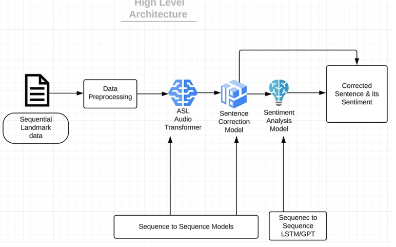
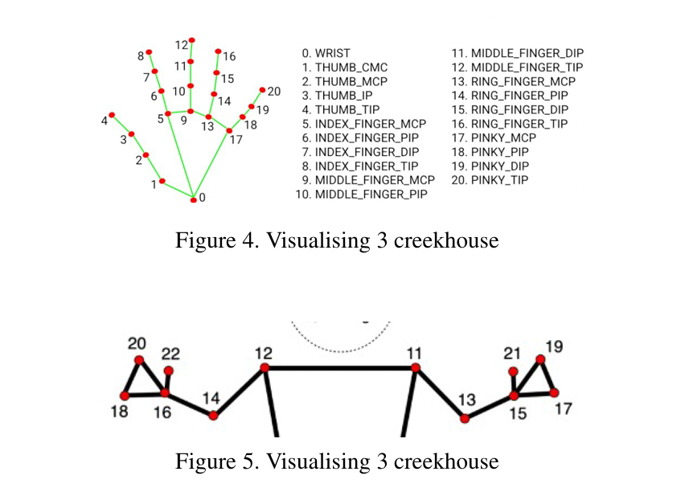
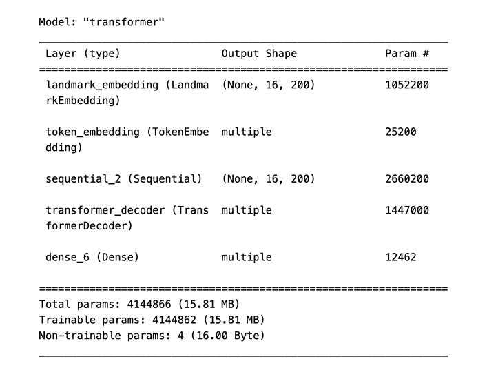
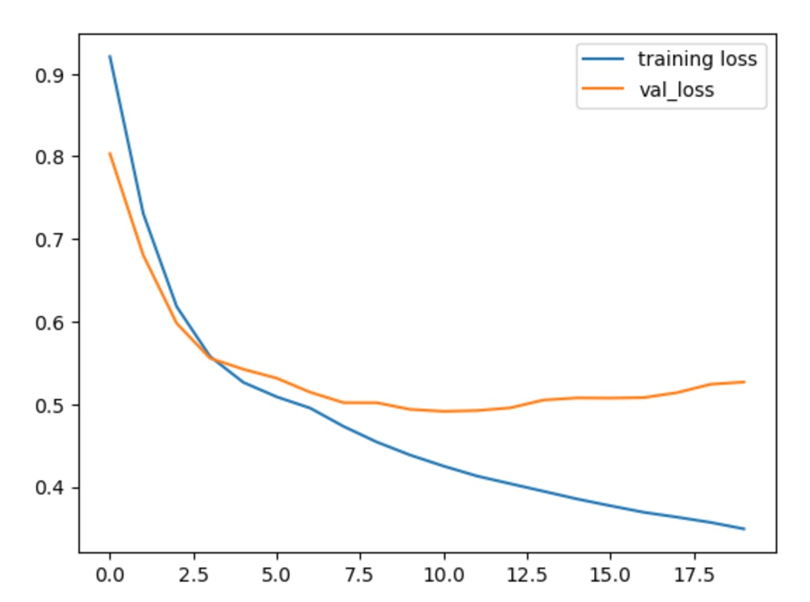

# AIM-5011-1_NLP

# Multimodal Approach for Enhancing ASL-to-Text Translation

This project aims to bridge communication gaps for the deaf and hard-of-hearing community by leveraging cutting-edge AI and deep learning techniques to translate American Sign Language (ASL) gestures into text. Our innovative approach focuses on enhancing accessibility and inclusivity using modern computational methods.

## Table of Contents

- [Introduction](#introduction)
- [Features](#features)
- [Methodology](#methodology)
- [Data](#data)
- [Models](#models)
- [Results](#results)
- [Challenges](#challenges)
- [Future Scope](#future-scope)
- [Contributors](#contributors)

## Introduction

This project addresses the profound isolation experienced by the deaf and mute community by providing a real-time ASL-to-text translator. Our system captures hand landmarks, processes them with Transformer-based models, and delivers accurate textual outputs. The inclusion of sentiment analysis further enhances the communication experience by interpreting the emotional nuances of gestures.

## Features

- Real-time ASL gesture recognition and text translation.
- Sentence correction for refined textual output.
- Sentiment analysis for interpreting emotional context.
- High accuracy achieved using advanced deep learning techniques.

## Methodology

The system architecture involves three primary models:
1. **ASL Audio Transformer**: Converts ASL gestures into text using a custom Transformer model.
2. **Sentence Correction Model**: Refines textual outputs to ensure grammatical and contextual accuracy.
3. **Sentiment Analysis Model**: Evaluates the emotional sentiment of the translated text.

## Data

We utilized multiple datasets, including:
- ASL hand landmark data from a Kaggle competition.
- Custom-annotated datasets for sentiment analysis.
- Output data from previous models for iterative training and validation.

Data preprocessing involved consolidating hand landmarks and corresponding phrases into TFRecord format for efficient processing.

## Models

1. **ASL Audio Transformer**:
   - Utilizes a Transformer architecture with custom embeddings for hand landmarks.
   - Measures accuracy using Levenshtein Distance.

2. **Sentence Correction Model**:
   - Combines Encoder-Decoder architecture and GPT-2 for refined output.

3. **Sentiment Analysis Model**:
   - Built using an LSTM architecture with pre-trained Word2Vec embeddings.
   - Achieved 79% sentiment classification accuracy.

## Results

- Real-time ASL-to-text translation with high accuracy.
- Enhanced sentence coherence and contextual alignment.
- Accurate sentiment recognition across positive, negative, and neutral expressions.

## Challenges

- Managing large datasets with missing values for non-dominant hand features.
- Compatibility issues with Apple M1/M2 CPUs.
- Custom optimizer development for learning rate scheduling.

## Future Scope

- Expanding to support a larger variety of ASL gestures, words, and sentences.
- Integrating multi-modal inputs (e.g., facial expressions and body poses).
- Improving real-time performance with optimized model architectures.

## Contributors

- **Onkar Kunte** (Yeshiva University) - [okunte@mail.yu.eu](mailto:okunte@mail.yu.eu)
- Sayed Raheel Hussain (Yeshiva University)
- Reiyo (Yeshiva University)
- Shashidhar Reddy (Yeshiva University)

